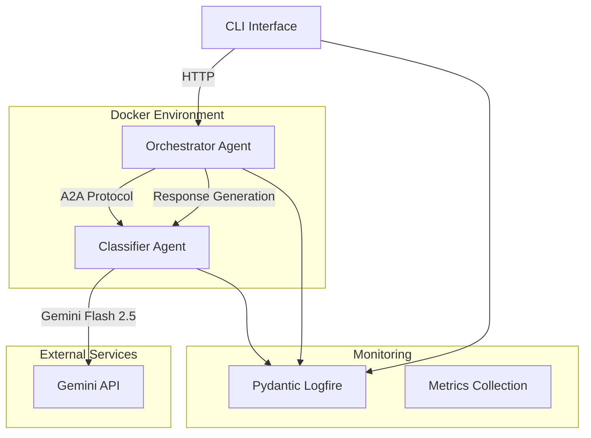

# WhatsApp Sales Assistant - Multi-Agent System

[](https://www.python.org/downloads/)
[](https://www.docker.com/)
[](tests/)
[](LICENSE)

A production-ready multi-agent system for WhatsApp sales assistance using advanced AI technologies including PydanticAI, Google ADK, and Gemini Flash 2.5. The system provides intelligent message classification and automated response generation with comprehensive observability and testing.

## 🏗️ Architecture Overview



### System Components

- **🤖 Classifier Agent**: Message classification using PydanticAI + Gemini Flash 2.5
- **🎯 Orchestrator Agent**: Workflow orchestration using Google ADK BaseAgent
- **💬 CLI Interface**: Rich terminal interface with async operations and spinners
- **🔗 A2A Protocol**: Type-safe agent-to-agent communication with trace IDs
- **📊 Observability**: Comprehensive logging and metrics with Pydantic Logfire
- **🐳 Docker**: Production-ready containerization and orchestration

## ✨ Key Features

### 🎯 Intelligent Classification
- **Multi-class classification**: Product information, PQR (Problems/Queries/Complaints), and general messages
- **High accuracy**: >90% classification accuracy with confidence scoring
- **Context-aware**: Conversation history integration for improved accuracy
- **Real-time processing**: Sub-second response times

### 🔄 Advanced Orchestration
- **Workflow management**: Google ADK BaseAgent with custom orchestration logic
- **Fault tolerance**: Comprehensive error handling and retry mechanisms
- **Scalable architecture**: Microservices design with independent scaling
- **State management**: Conversation context and session handling

### 🚀 Production Ready
- **Docker containers**: Multi-stage builds with security best practices
- **Health monitoring**: Comprehensive health checks and metrics collection
- **Logging**: Structured logging with Pydantic Logfire integration
- **Testing**: >90% test coverage with unit, integration, and E2E tests
- **CI/CD**: Complete automation with Makefile and validation pipelines

### 🎨 Developer Experience
- **Rich CLI**: Beautiful terminal interface with colors, spinners, and panels
- **Type safety**: Full Pydantic integration with runtime validation
- **Hot reload**: Development environment with auto-reload
- **Documentation**: Comprehensive API docs and interactive examples

## 🚀 Quick Start

### Prerequisites

- **Python 3.12+**
- **Docker & Docker Compose**
- **Gemini API Key** (get one at [Google AI Studio](https://makersuite.google.com/app/apikey))
- **Make utility** (for build automation)

### 1. Initial Setup

```bash
# Clone the repository
git clone <repository-url>
cd whatsapp-sales-assistant

# Run initial setup
make setup

# Configure environment
cp .env.example .env
# Edit .env with your Gemini API key and other settings
```

### 2. Start Development Environment

```bash
# Start all services with Docker
make up

# Or run individual services
make build          # Build Docker images
make dev           # Start development environment
```

### 3. Test the System

```bash
# Run all tests
make test

# Run specific test types
make test-unit      # Unit tests only
make test-integration # Integration tests
make test-coverage # Tests with coverage report
```

### 4. Use the CLI

```bash
# Interactive mode
make cli-interactive

# Single message
make cli-message

# Test connection
make cli-test

# Or run directly
python -m cli.main --help
```

## 🛠️ Development Guide

### Project Structure

```
whatsapp-sales-assistant/
├── agents/                     # Agent implementations
│   ├── classifier/            # PydanticAI classifier
│   │   ├── domain/           # Domain models
│   │   ├── adapters/         # Input/output adapters
│   │   ├── agent.py          # Main agent implementation
│   │   ├── Dockerfile        # Container definition
│   │   └── requirements.txt  # Dependencies
│   └── orchestrator/         # Google ADK orchestrator
│       ├── domain/           # Domain models
│       ├── adapters/         # Input/output adapters
│       ├── agent.py          # Main agent implementation
│       ├── Dockerfile        # Container definition
│       └── requirements.txt  # Dependencies
├── cli/                      # CLI interface
│   ├── main.py              # CLI entry point
│   ├── client.py            # HTTP client
│   └── spinner.py           # UI components
├── shared/                   # Shared components
│   ├── a2a_protocol.py      # Agent-to-agent protocol
│   ├── observability.py     # Logging and metrics
│   └── utils.py             # Common utilities
├── config/                   # Configuration
│   ├── settings.py          # Pydantic settings
│   └── logging.yaml         # Logging configuration
├── tests/                    # Test suite
│   ├── agents/              # Agent tests
│   ├── integration/         # Integration tests
│   ├── fixtures/            # Test data
│   └── conftest.py          # Test configuration
├── docker-compose.yml        # Service orchestration
├── Makefile                 # Build automation
└── README.md               # This file
```

### Technology Stack

#### Core Technologies
- **[PydanticAI](https://ai.pydantic.dev/)**: Type-safe AI agent framework with Pydantic integration
- **[Google ADK](https://github.com/google/adk)**: Agent Development Kit for workflow orchestration
- **[Gemini Flash 2.5](https://ai.google.dev/)**: Google's latest multimodal AI model
- **[FastAPI](https://fastapi.tiangolo.com/)**: Modern async web framework
- **[Pydantic](https://pydantic.dev/)**: Data validation with Python type annotations

#### Infrastructure
- **[Docker](https://www.docker.com/)**: Containerization and orchestration
- **[Pydantic Logfire](https://logfire.pydantic.dev/)**: Observability and monitoring
- **[Rich](https://rich.readthedocs.io/)**: Beautiful terminal interfaces
- **[AsyncIO](https://docs.python.org/3/library/asyncio.html)**: Asynchronous programming

#### Testing & Quality
- **[pytest](https://pytest.org/)**: Testing framework with async support
- **[Ruff](https://docs.astral.sh/ruff/)**: Lightning-fast Python linter
- **[Black](https://black.readthedocs.io/)**: Code formatting
- **[mypy](https://mypy.readthedocs.io/)**: Static type checking

### Environment Configuration

Create a `.env` file based on `.env.example`:

```bash
# API Configuration
GEMINI_API_KEY=your_gemini_api_key_here

# Service Configuration
CLASSIFIER_HOST=localhost
CLASSIFIER_PORT=8001
ORCHESTRATOR_HOST=localhost
ORCHESTRATOR_PORT=8080

# Model Configuration
MODEL_NAME=google-gla:gemini-2.0-flash
CONFIDENCE_THRESHOLD=0.7
GEMINI_TEMPERATURE=0.0
GEMINI_MAX_TOKENS=100

# Logging and Monitoring
LOG_LEVEL=INFO
TRACE_ENABLED=true

# Development Settings
IS_DOCKER_ENVIRONMENT=false
HTTP_TIMEOUT=30.0
HTTP_RETRIES=3
```

### Available Make Commands

```bash
# Setup and Environment
make setup          # Initial project setup
make dev           # Start development environment
make clean         # Clean artifacts
make clean-all     # Clean everything

# Code Quality
make format        # Format code with black
make lint         # Lint with ruff
make type-check   # Type check with mypy
make quality      # Run all quality checks

# Testing
make test         # Run all tests
make test-unit    # Unit tests only
make test-integration # Integration tests
make test-coverage # Coverage report
make test-fast    # Exclude slow tests

# Docker Operations
make build        # Build Docker images
make up          # Start services
make down        # Stop services
make logs        # View logs
make status      # Service status

# Health and Monitoring
make health      # Health checks
make metrics     # Service metrics

# CLI Operations
make cli-interactive # Interactive CLI
make cli-test    # Test CLI connection
make cli-message # Send test message

# Validation Pipeline
make validate    # Complete validation
make ci         # CI pipeline
```

## 🔧 Configuration

### Service Configuration

#### Classifier Agent
```yaml
# PydanticAI + Gemini Flash 2.5
model_name: "google-gla:gemini-2.0-flash"
confidence_threshold: 0.7
temperature: 0.0
max_tokens: 100
timeout: 30.0
```

#### Orchestrator Agent
```yaml
# Google ADK BaseAgent
max_retries: 3
timeout: 30.0
workflow_timeout: 60.0
concurrent_requests: 10
```

#### A2A Protocol
```yaml
# Agent-to-Agent Communication
trace_id_enabled: true
message_validation: true
encryption: false  # Future implementation
compression: true
```

### Logging Configuration

The system uses comprehensive structured logging with Pydantic Logfire:

```yaml
# Development: Colored console output
# Production: JSON structured logs
# Files: Rotating logs with retention
# Monitoring: Integration with external systems
```

See `config/logging.yaml` for detailed configuration.

## 🧪 Testing

### Test Coverage

The project maintains >90% test coverage across all components:

- **Unit Tests**: Individual component testing with mocks
- **Integration Tests**: A2A protocol and service communication
- **End-to-End Tests**: Complete system flow validation
- **Performance Tests**: Load testing and performance validation

### Running Tests

```bash
# All tests with coverage
make test-coverage

# Specific test types
make test-unit           # Fast unit tests
make test-integration    # Integration tests
make test-fast          # Exclude slow tests

# Performance testing
make load-test          # Load testing
make performance-test   # Performance validation
```

### Test Structure

```
tests/
├── agents/
│   ├── classifier/
│   │   └── test_agent.py      # Classifier tests with TestModel
│   └── orchestrator/
│       └── test_agent.py      # Orchestrator tests with AgentEvaluator
├── shared/
│   └── test_a2a_protocol.py   # A2A protocol tests
├── integration/
│   └── test_end_to_end.py     # E2E system tests
└── fixtures/
    └── test_data.py           # Test data and fixtures
```

## 🔧 API Reference

### Classifier Agent API

#### POST `/api/v1/classify`
Classify a user message.

```json
{
  "user_message": "What's the price of iPhone 15?",
  "user_id": "user123",
  "session_id": "session456",
  "context": {
    "conversation_history": []
  }
}
```

**Response:**
```json
{
  "classification": {
    "label": "product_information",
    "confidence": 0.92,
    "reasoning": "User asking about product pricing"
  },
  "processing_time": 0.5,
  "trace_id": "trace-123"
}
```

#### GET `/api/v1/health`
Health check endpoint.

#### GET `/api/v1/metrics`
Service metrics and statistics.

### Orchestrator Agent API

#### POST `/api/v1/orchestrate-direct`
Process a user message with orchestration.

```json
{
  "user_message": "My order is delayed",
  "user_id": "user123",
  "session_id": "session456",
  "include_classification": true
}
```

**Response:**
```json
{
  "response": "I understand your concern about the delayed order. Let me help you with that.",
  "response_type": "PQR",
  "classification": {
    "label": "PQR",
    "confidence": 0.88
  },
  "processing_time": 1.2,
  "trace_id": "trace-123"
}
```

### CLI Interface

#### Interactive Mode
```bash
python -m cli.main
```

#### Single Message Mode
```bash
python -m cli.main -m "What's the price of iPhone 15?"
```

#### Connection Test
```bash
python -m cli.main --test-connection
```

## 📊 Monitoring and Observability

### Metrics Collection

The system collects comprehensive metrics:

- **Request metrics**: Count, latency, success rate
- **Classification metrics**: Accuracy, confidence distribution
- **System metrics**: Memory, CPU, response times
- **Business metrics**: User engagement, conversation flows

### Health Checks

Multi-level health checks:

```bash
# Application health
GET /api/v1/health

# Detailed status
GET /api/v1/status

# Service metrics
GET /api/v1/metrics

# CLI health check
make health
```

### Logging

Structured logging with multiple outputs:

- **Console**: Colored output for development
- **Files**: Rotating logs with retention policies
- **Monitoring**: Integration with external systems
- **Security**: Audit logs with sensitive data redaction

## 🚀 Deployment

### Docker Deployment

```bash
# Build and start all services
make build
make up

# Check status
make status
make health

# View logs
make logs
```

### Production Considerations

1. **Environment Variables**: Configure all required variables
2. **Resource Limits**: Set appropriate CPU/memory limits
3. **Health Checks**: Configure load balancer health checks
4. **Logging**: Configure log aggregation
5. **Monitoring**: Set up metrics collection
6. **Security**: Review security configurations

### Scaling

The system is designed for horizontal scaling:

- **Classifier**: Stateless, can scale based on CPU
- **Orchestrator**: Session-aware, can scale with session affinity
- **CLI**: Client-side, no scaling needed

## 🤝 Contributing

### Development Workflow

1. **Setup**: Run `make setup` for initial configuration
2. **Development**: Use `make dev` for development environment
3. **Quality**: Run `make quality` before committing
4. **Testing**: Ensure `make test-coverage` passes
5. **Validation**: Run `make validate` for complete validation

### Code Standards

- **Python 3.12+** with type hints
- **Black** code formatting (line length 100)
- **Ruff** linting with strict settings
- **mypy** type checking in strict mode
- **pytest** for testing with >90% coverage
- **Conventional commits** for commit messages

### Pull Request Process

1. Fork the repository
2. Create a feature branch
3. Implement changes with tests
4. Run complete validation: `make validate`
5. Submit pull request with description

## 📚 Additional Resources

### Documentation

- **[PydanticAI Documentation](https://ai.pydantic.dev/)**
- **[Google ADK Documentation](https://github.com/google/adk)**
- **[Gemini API Documentation](https://ai.google.dev/docs)**
- **[FastAPI Documentation](https://fastapi.tiangolo.com/)**
- **[Docker Documentation](https://docs.docker.com/)**

### Learning Resources

- **[Async Python Guide](https://docs.python.org/3/library/asyncio.html)**
- **[Pydantic Tutorial](https://pydantic.dev/tutorial/)**
- **[Docker Best Practices](https://docs.docker.com/develop/best-practices/)**

### Community

- **Issues**: [GitHub Issues](https://github.com/your-org/whatsapp-sales-assistant/issues)
- **Discussions**: [GitHub Discussions](https://github.com/your-org/whatsapp-sales-assistant/discussions)

## 📄 License

This project is licensed under the MIT License - see the [LICENSE](LICENSE) file for details.

## 🙏 Acknowledgments

- **[Pydantic Team](https://pydantic.dev/)** for the excellent AI framework
- **[Google](https://ai.google.dev/)** for Gemini Flash 2.5 and ADK
- **[FastAPI](https://fastapi.tiangolo.com/)** for the amazing web framework
- **Open Source Community** for the foundational tools and libraries

---

**🚀 Ready to build intelligent conversational AI?**

Get started with `make setup` and explore the powerful multi-agent system!

For questions, issues, or contributions, please visit our [GitHub repository](https://github.com/your-org/whatsapp-sales-assistant).